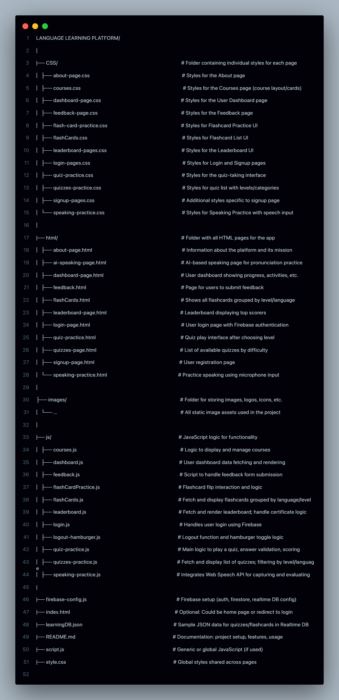

# Language-learning-sysmtem (FluencyMate)

## Introduction
*FluencyMate is an innovative language learning web application designed to help users master new languages through a fully interactive, engaging, and personalized learning experience. The primary purpose of the app is to simplify language acquisition by combining AI-powered tools, gamified learning elements, and real-world conversation practice into a single, accessible platform.*

*The core functionality of FluencyMate includes interactive lessons, real-time quizzes with instant feedback, speech recognition for pronunciation practice, flashcards with spaced repetition, and detailed progress tracking. Users can choose from multiple languages such as English, Spanish, French, German, Japanese, and more, with support for various difficulty levels.*

*This app addresses common problems faced by language learners—such as lack of consistent practice, low engagement, and limited access to native speakers—by offering a rich, adaptive, and user-friendly environment. Whether you're a beginner or an advanced learner, FluencyMate guides your journey step by step, making language learning effective, fun, and achievable.*

## Project Type
FluencyMate is a fullstack web application that combines both frontend and backend technologies to deliver a seamless and dynamic language learning experience.

- Frontend: Built using HTML, CSS, and JavaScript, it provides a responsive and interactive user interface with features like quizzes, flashcards, progress dashboards, and speaking practice tools.

- Backend: Powered by Firebase (Realtime Database, Authentication, and Storage), it handles user management, real-time data syncing, quiz tracking, flashcard storage, and speech data analysis.

## Deplolyed App
- Frontend: https://fluencymate.netlify.app/
- Backend: https://console.firebase.google.com/
- Database: https://learning-language-system-default-rtdb.asia-southeast1.firebasedatabase.app/
- Github - https://github.com/abhishekverma22/Language-learning-system

## Directory Structure



## Video Walkthrough of the project


## Video Walkthrough of the codebase

## Features
List out the key features of your application.

1.  Authentication & Protected Routes
The app uses Firebase Authentication to manage user access securely.
- Users must sign up or log in to use the app.
- After logging in, users are redirected to the Dashboard.
- Only authenticated users can access the following pages:
          * Dashboard
          * Quizzes
          * Flashcards
          * Speaking Practice
          * Leaderboard
          * Feedback
🚫 Unauthorized Access Protection
If a user tries to access a protected page directly using the URL (e.g., /html/dashboard-page.html) without logging in, they are:
        * Automatically redirected to the login page
        * Prevented from viewing any private content

2. Dashboard
- Personalized dashboard showing user progress
- Central hub after login for navigating to quizzes, flashcards, speaking practice, Speaking with AI.
- dashboard-page.html, dashboard.js

3. Language Quizzes
- Users can select a language and level (easy, medium, hard)
- Quiz with 20 questions per level
- Only one quiz per level allowed per day
- Tracks total, attempted, correct questions
- quiz-page.html, quizzes-practice.js - > select language inside 
      - quiz-practice.html , quize-pratice.js -> select level then start quiz 

4. Flashcards
- Flashcards available for 12+ languages
- Each level has 20 cards per language
- Only five flasshCard per level allowed per day
- Helps users revise vocabulary interactively
- flashCards.html, flashCardPractice.js -> select language
      - flash-practics.html, flash-pratics.js -> select level then you are able to see flashcard

5. Speaking Practice
- Users speak the given sentence aloud
- App uses Web Speech API to transcribe speech
- Tracks spoken sentences for learning
- Live Feedback after Speaking 
- speaking-practice.html, speaking-practice.js
      - select langauge first then able to speak

6. Leaderboard
- 📊 Shows quiz scores and flashcard performance grouped by date.
- 🎯 Divided by difficulty level and language.
- 🧠 Helps track daily learning progress.
- 🤝 Builds motivation and competition among users.    

7. Feedback System
- Users can submit feedback about the app or content
- Name and Email auto fill
- Data is stored and can be reviewed by admins
- feedback.html, feedback.js

8. Responsive Design
- All pages styled with modular CSS files
- Fully responsive layout for desktop, tablet, and mobile
- Consistent theme across pages

9. Navigation System
- Hamburger menu for mobile devices
- Logout functionality handled across all protected routes
- logout-hamburger.js

10. Real-Time Database Integration
- Firebase Realtime Database used for storing:
- Quiz data
- Flashcard sets
- User progress and attempts
- learningData.json

11. Multi-Language Support
- Supports flashcards and quizzes for:
    English, Spanish, French, German, Japanese, Russian, Italian, Persian, Dutch, Turkish, Greek, Norwegian, Portuguese, Hindi
- Easy to expand with more languages


##  Design Decisions or Assumptions 
- Built using pure HTML, CSS, JavaScript (no external frameworks).
- Used Firebase for authentication, database, and user data management.
- All main features (quiz, flashcards, speaking) are in separate modular pages.
- App is fully responsive across all devices.
- Authentication check on every protected page — redirects to login if user is not logged in.
- Each quiz has 20 questions per level; only 1 attempt per level/day allowed.
- Flashcards are grouped by language and level; used for self-revision.
- Web Speech API used for speaking practice — assumes mic access is granted.
- Leaderboard shows data grouped by date, then by quiz and flashcard.
- Certificate generation is planned but not implemented yet.

## Installation & Getting started
Follow these steps to set up and run the app locally:

1. Clone the Repository
```
git clone https://github.com/abhishekverma22/Language-learning-system.git
cd language-learning-app

```
2. Open the Project
You can open the project in VS Code, Sublime, or any text editor of your choice.

3. Firebase Setup
- Create one file in root folder name : firebase-config.js and put your own configration templates for enable firebase 
See blow for sample
- Create a Firebase project at https://console.firebase.google.com
- Enable:
         - Authentication (Email/Password)
         - Realtime Database
         - Firestore 
- Copy your Firebase config and paste it into firebase-config.js

```
// firebase-config.js
const firebaseConfig = {
  apiKey: "YOUR_API_KEY",
  authDomain: "YOUR_AUTH_DOMAIN",
  databaseURL: "YOUR_DB_URL",
  projectId: "YOUR_PROJECT_ID",
  storageBucket: "YOUR_BUCKET",
  messagingSenderId: "YOUR_SENDER_ID",
  appId: "YOUR_APP_ID"
};
```


4. Run the App
Simply open index.html in your browser to start using the app.
⚠️ For full functionality (like auth redirect), use a local server:

```
# Option 1: With VS Code
Use Live Server extension

```

✅ 5. Try the Features
- Sign up / Log in
- Explore quizzes, flashcards, speaking practice
- View the leaderboard
- Try submitting feedback

## Usage

After logging in, users land on the Dashboard, which provides quick access to all key features of the Language Learning Platform:

✅ Daily Practice Goals
Track your daily language learning tasks such as:
Interactive Quizzes
Flashcards
Speaking Practice
Ai- Powered Path - Web Speech API to transcribe speech
Leaderboard
Feedback


## Credentials
Email - abhi@gmail.com / pratham@gmail.com
Password - 123456

## APIs Used
This application relies on the following external APIs:

- Firebase Authentication
        Secure user login & registration
        Firebase Auth Docs:  https://firebase.google.com/docs/auth

 -Firebase Realtime Database
        Stores user progress, quiz scores, flashcards, etc.       
        Realtime DB Docs : https://firebase.google.com/docs/database

- Web Speech API
        Provides speech recognition for speaking practice
        Web Speech API Reference : https://developer.mozilla.org/en-US/docs/Web/API/Web_Speech_API

## API Endpoints
Here are the key paths in Firebase Realtime Database used in the app:

- users/{uid} – User profile and progress data
- quizzes/{language}/{difficulty} – Quiz questions by language and difficulty
- flashcards/{language}/{level} – Flashcard sets
- leaderboard/{uid} – User score entries for leaderboard

## Technology Stack
- HTML5 : Markup language for structuring web conten
- CSS3 : Styling language used to design and make UI responsive
- JavaScript (Es6) : Adds interactivity and handles app logic
- Firebase Auth : Handles user authentication (login/signup/ track user)
- Firebase Realtime Database : Stores quiz data, flashcards 
- Firebase Firestore Database :Store user data flashCard Progress / Quiz Progress 
- Web speech API : Enables speech recognition for pronunciation feedback
- VS code : 	Development environment and local preview
- Netlify :  Used for seamless deployment and hosting of the web application.

